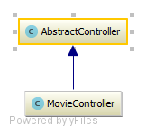
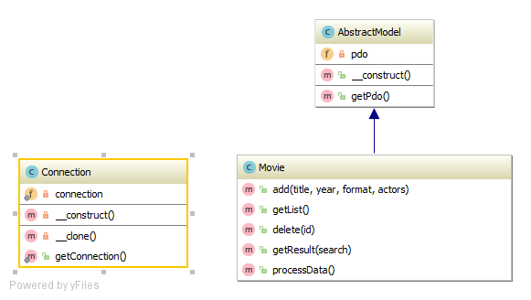

# Запуск програми

1. Скопіювати директорію `www` на вебсервер
2. Зробити міграцію в БД з файлу `schema.sql`
3. Виконати команду `composer install` в директорії `www`
4. Налаштувати Apache/Nginx
5. Відкрити сторінку в браузері

# Компонент менеджер

Для завантаження сторонніх бібліотек, було обрано і сконфігуровано `Composer`

# Архітектура програми

Програма написана з використанням патерну MVC


## Контролери

Програма складається з двох контролерів



Абстрактного:
```
\Masha\Controller\AbstractController
```

Та контролеру для фільмів
```
\Masha\Controller\MovieController
```

## Моделі

За бізнес-логіку відповідають 3 моделі:

* `\Masha\Model\AbstractModel` - Абстрактна модель даних
* `\Masha\Model\Connection` - Модель підключення до БД (Singleton)
* `\Masha\Model\Movie` - Модель для роботи з `Entity` фільму



## View

* Для роботи з представленням даних, було обрано бібліотеку `Smarty`
* Шаблони знаходяться в директорії `templates`


